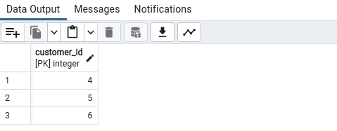
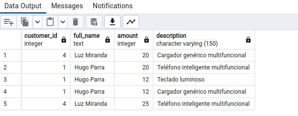
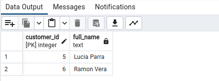
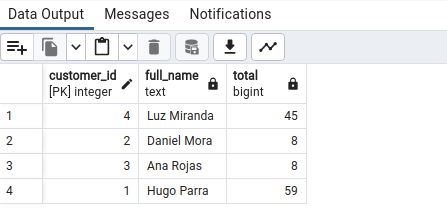
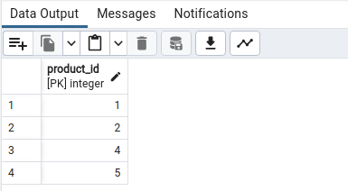
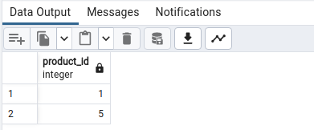
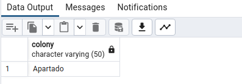

# CONSULTA 1 

## ID de los clientes de la Ciudad de Bogotá

 ```
  SELECT customer_id FROM customers WHERE LOWER(colony ) = 'bogota';
 ```


# CONSULTA 2

## ID y descripción de los productos que cuesten menos de 100.000 pesos

``` 
  SELECT product_id, description
  FROM products
  WHERE price < 100000;
```


# CONSULTA 3 

## ID y nombre de los clientes, cantidad vendida, y descripción del producto, en las ventas en las cuales se vendieron más de 10 unidades.
``` 
  SELECT c.customer_id, 
      c.first_name || ' ' || 
      c.last_name as full_name, s.amount, p.description
  FROM sales as s
  NATURAL JOIN products as p
  NATURAL JOIN customers as c
  WHERE s.amount > 10
```




# CONSULTA 4 

## D y nombre de los clientes que no aparecen en la tabla de ventas (Clientes que no han comprado productos)

```
  SELECT c.customer_id, first_name || ' ' || last_name full_name
  FROM  customers c
  NATURAL LEFT JOIN sales s
  where s.sale_id IS NULL;

  -- OPCIÓN DOS
  SELECT customer_id, first_name || ' ' || last_name full_name
  FROM customers  
  WHERE customer_id NOT IN (SELECT customer_id FROM sales);
```




# CONSULTA 5 

## ID y nombre de los clientes que han comprado todos los productos de la empresa.

```
  SELECT customer_id, first_name || ' ' || last_name full_name
  FROM customers c  
  WHERE (SELECT COUNT(DISTINCT s.product_id) 
      FROM sales s 
      WHERE c.customer_id = s.customer_id) = (SELECT COUNT(*) FROM products);
```


# CONSULTA 6

## ID y nombre de cada cliente y la suma total (suma de cantidad) de los productos que ha comprado. 

```
  SELECT customer_id, first_name || ' ' || last_name full_name, SUM(s.amount) AS total
  FROM customers
  NATURAL JOIN sales s
  GROUP BY customer_id
```



# CONSULTA 7

## OID de los productos que no han sido comprados por clientes de buga.

```
  SELECT Product_id
  FROM products  
  WHERE Product_id NOT IN (
    SELECT Product_id FROM customers
    NATURAL JOIN sales
    WHERE LOWER(colony) = 'buga'
  );
```




# CONSULTA 8

## ID de los productos que se han vendido a clientes de apartado y que también se han vendido a clientes de bogota.

```
  SELECT DISTINCT Product_id  
  FROM customers 
  NATURAL JOIN sales 
  WHERE LOWER(colony) = 'apartado'             
  AND Product_id 
  IN (SELECT Product_id                                               
      FROM customers 
    NATURAL JOIN sales                                                
    WHERE LOWER(colony) = 'bogota'
    );
```



# CONSULTA 9

## Nombre de las ciudades en las que se han vendido todos los productos.

```
  SELECT colony 
  FROM customers 
  NATURAL JOIN sales 
  GROUP BY colony 
  HAVING COUNT(DISTINCT Product_id) = (SELECT COUNT(*) FROM products); 
```


